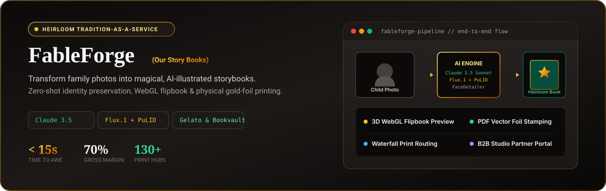
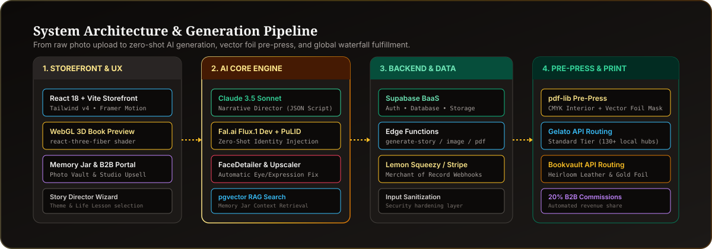
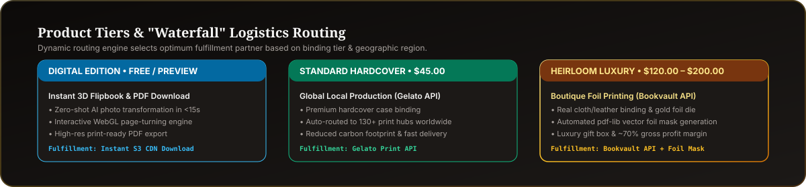

<p align="center">
  
</p>

<p align="center">
  <strong>Transforming family photos into magical, heirloom-quality storybooks using zero-shot AI identity engine and physical gold-foil print fulfillment.</strong>
</p>

<p align="center">
  <a href="#quick-start"><strong>Quick Start</strong></a> •
  <a href="#system-architecture"><strong>Architecture</strong></a> •
  <a href="#key-features"><strong>Features</strong></a> •
  <a href="#print-fulfillment--unit-economics"><strong>Logistics</strong></a> •
  <a href="#development"><strong>Development</strong></a>
</p>

---

## Overview

**FableForge (Our Story Books)** is a *"tradition-as-a-service"* platform designed to bridge the gap between digital rapidity and physical heirlooms. By uploading a single photo of a child, parents and grandparents can instantly generate a customized, AI-illustrated hardcover storybook starring their child.

The system combines zero-shot face identity preservation, Claude 3.5 Sonnet narrative scripting, an interactive WebGL 3D flipbook preview, and an automated dual-tier print fulfillment routing pipeline.

---

## System Architecture

<p align="center">
  
</p>

### Pipeline Breakdown

1. **Storefront & 3D Preview (`src/components/`, `src/pages/`)**
   - Built with **React 18**, **TypeScript**, **Vite**, **Tailwind CSS (v4)**, and **Framer Motion**.
   - Custom WebGL 3D book canvas powered by `react-three-fiber` with real-time page-turning physics and gold foil shader effects (`Book3DPreview.tsx`).
   - Integrated **B2B Photographer Portal** for studios to manage client sessions and earn 20% automated commissions.

2. **AI Generation Core (`src/lib/narrative.ts`, `src/lib/imageGen.ts`)**
   - **Narrative Director:** **Anthropic Claude 3.5 Sonnet** generates structured multi-page story scripts with tailored moral lessons.
   - **Digital Twin Engine:** **Fal.ai Flux.1 [dev]** paired with **PuLID** for zero-shot facial identity preservation without lengthy model training.
   - **Face Detailer:** Automatic eye, facial symmetry, and expression restoration via MediaPipe/YOLO pipelines.
   - **Memory Jar Vector Search:** Supabase `pgvector` embeddings enable long-term narrative consistency across annual storybook collections.

3. **Backend & Merchant Engine (`supabase/`)**
   - **Supabase BaaS:** Auth, PostgreSQL schema with RLS, Storage buckets, and input sanitization.
   - **Merchant of Record:** Integrated **Lemon Squeezy** & **Stripe** webhooks deployed as Supabase Edge Functions (`supabase/functions/lemonsqueezy-webhook`).

4. **Pre-Press & Print Fulfillment (`src/lib/pdfGenerator.ts`, `src/lib/fulfillment.ts`)**
   - **Pre-Press PDF Engine:** Serverless `pdf-lib` pipeline compiling CMYK `interior.pdf` files along with vector black `cover_foil_mask.pdf` files for physical hot-foil die stamping.

---

## Print Fulfillment & Unit Economics

FableForge uses a **"Waterfall" logistics routing model** to balance delivery speed, global availability, and luxury quality.

<p align="center">
  
</p>

### Tier Matrix

| Tier | Price Point | Binding & Finish | Fulfillment Partner | Target Audience |
| :--- | :--- | :--- | :--- | :--- |
| **Digital Edition** | **Free / Included** | WebGL 3D Flipbook & High-Res PDF | Supabase S3 Storage | Instant Web Preview |
| **Standard Hardcover** | **$45.00** | Matte Hardcover Case Binding | **Gelato API** (130+ local print hubs) | Everyday Gifts & Fast Shipping |
| **Heirloom Luxury** | **$120.00 – $200.00** | Cloth/Leather Binding + Hot Gold Foil Stamping | **Bookvault API** (Specialty Pre-Press) | Heritage Gifts & Legacy Keepsakes |

> **Unit Economics (Heirloom Edition):** At a **$200.00** retail price, COGS breakdown includes ~$40.00 (Bookvault leather binding & foil blocking), ~$5.00 (Flux.1 GPU compute), and ~$15.00 (Packaging/Shipping), yielding a **~$140.00 Gross Profit (~70% Margin)**.

---

## Key Features

### Phase 1: Proof of Magic ✅
- **Instant Magic Preview:** Zero-shot AI photo transformation.
- **Interactive Story Director:** Configuration wizard for child name, theme, and life lesson.
- **3D Flipbook Editor:** Page-turning preview environment.
- **Heirloom Design System:** Gold foil UI visual tokens and dark stone aesthetics.

### Phase 2: The Luxury Upgrade ✅
- **User Authentication:** Supabase Auth with protected routes and persistent user sessions.
- **My Magic Library:** Dashboard for saving and managing created storybooks.
- **Claude 3.5 Narrative Director:** Automated story script synthesis.
- **Multi-Tier Checkout:** Tier selection (Digital, Hardcover, Heirloom) with security input sanitization.

### Phase 3: The Tradition Ecosystem ✅
- **Memory Jar:** Year-round photo collection with monthly prompts for annual memory books.
- **Digital Twin Engine:** Fal.ai Flux.1 image generation pipeline.
- **B2B Photographer Portal:** Studio partner dashboard with automated 20% revenue share.

### Phase 4: The Publisher ✅
- **Lemon Squeezy Integration:** Merchant of Record handling global tax, checkout, and webhooks.
- **PDF Pre-Press Engine:** Automated CMYK PDF and vector gold foil mask generation.
- **Automated Fulfillment:** Gelato & Bookvault print API routing.
- **Order Tracking:** Real-time order status tracking and digital PDF downloads.

### Phase 5: Advanced Features ✅
- **PuLID Identity Preservation:** High-fidelity facial consistency via Flux.1 dev + PuLID.
- **FaceDetailer:** Automatic eye restoration and expression polishing.
- **WebGL Gold Foil Shader:** `react-three-fiber` WebGL shader for realistic foil reflections.
- **Vector Database (RAG):** `pgvector` embedding storage for Memory Jar narrative consistency.

---

## Development

### 1. Installation

```bash
git clone https://github.com/your-org/FableForge.git
cd FableForge
npm install
```

### 2. Environment Configuration

Create a `.env` file in the root directory:

```env
# Supabase Configuration
VITE_SUPABASE_URL=https://your-project.supabase.co
VITE_SUPABASE_ANON_KEY=your_supabase_anon_key

# AI Services (Optional - falls back to simulation mode)
VITE_ANTHROPIC_API_KEY=your_anthropic_key
VITE_FAL_API_KEY=your_fal_api_key

# Lemon Squeezy Payments (Optional - falls back to simulation mode)
VITE_LEMONSQUEEZY_API_KEY=your_lemonsqueezy_api_key
VITE_LEMONSQUEEZY_STORE_ID=your_store_id
VITE_LS_VARIANT_STANDARD=your_digital_variant_id
VITE_LS_VARIANT_PREMIUM=your_hardcover_variant_id
VITE_LS_VARIANT_HEIRLOOM=your_heirloom_variant_id

# Print Fulfillment (Optional - falls back to simulation mode)
VITE_GELATO_API_KEY=your_gelato_key
VITE_BOOKVAULT_API_KEY=your_bookvault_key
```

### 3. Database Setup

Execute the migration scripts in order against your Supabase instance:

1. `supabase/migrations/initial_schema.sql` (Phase 2 - Core Schema & Auth)
2. `supabase/migrations/phase3_memory_jar.sql` (Phase 3 - Memory Jar Schema)
3. `supabase/migrations/phase4_photographer_portal.sql` (Phase 4 - B2B Photographer Schema)
4. `supabase/migrations/phase5_vector_db.sql` (Phase 5 - pgvector RAG Schema)

### 4. Deploy Edge Functions

Deploy backend Edge Functions using the Supabase CLI:

```bash
# Payment Processing Webhooks
supabase functions deploy lemonsqueezy-webhook

# AI Generation Engine
supabase functions deploy generate-story
supabase functions deploy generate-image

# PDF Pre-Press Generation
supabase functions deploy generate-pdf
```

### 5. Running & Building

```bash
# Start local development server
npm run dev

# Production build
npm run build
```

---

## Repository Structure

```text
FableForge/
├── .github/
│   └── assets/              # README visual SVGs and diagrams
├── src/
│   ├── components/          # React components
│   │   ├── auth/            # Auth forms & protected routes
│   │   ├── features/        # Book3DPreview, MagicUploader, BookPage
│   │   ├── layout/          # Navbar, Footer, Container
│   │   └── ui/              # Buttons, Cards, Modal primitives
│   ├── context/             # React Contexts (AuthContext)
│   ├── data/                # Sample stories and static data
│   ├── lib/                 # Service clients & integrations
│   │   ├── supabase.ts      # Supabase client & queries
│   │   ├── narrative.ts     # Claude 3.5 Sonnet story prompt engine
│   │   ├── imageGen.ts      # Fal.ai Flux.1 + PuLID engine
│   │   ├── stripe.ts        # Payment helper functions
│   │   ├── pdfGenerator.ts  # Pre-press PDF & foil mask builder
│   │   └── fulfillment.ts   # Gelato & Bookvault print APIs
│   ├── pages/               # Application routes
│   └── types/               # TypeScript interfaces
├── supabase/
│   ├── functions/           # Supabase Edge Functions
│   └── migrations/          # SQL Database schema migrations
├── masterplan.md            # Product strategy & unit economics
└── README.md                # Project documentation
```

---

## License

Proprietary. All rights reserved.
